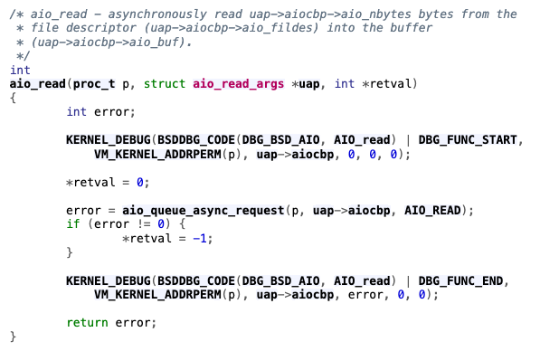
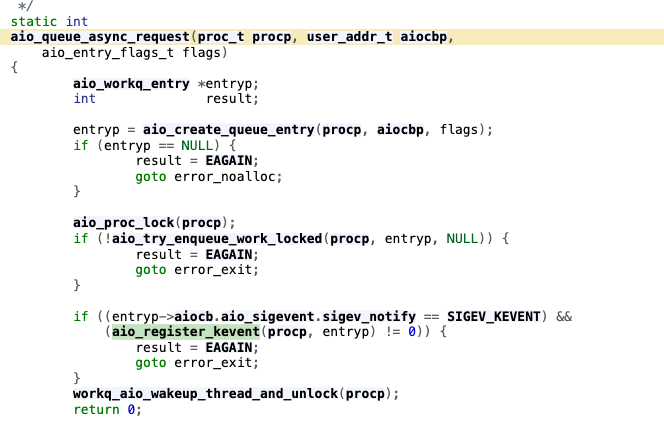
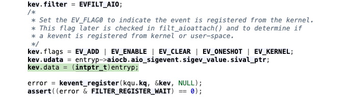
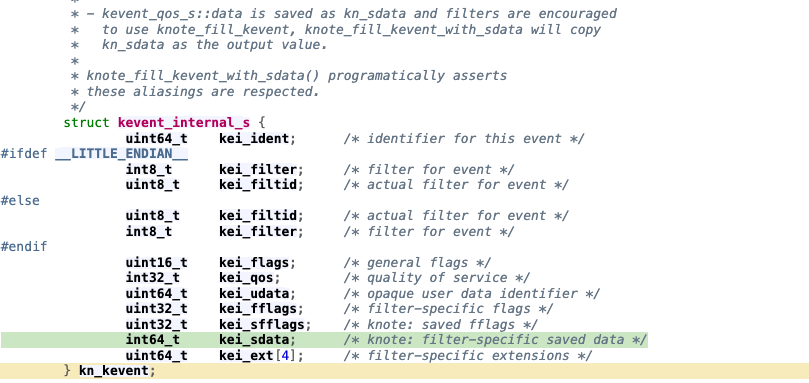
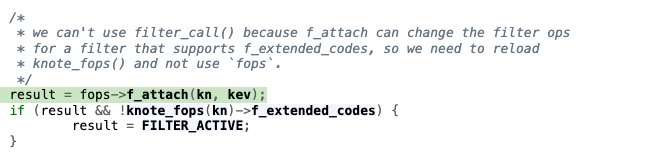
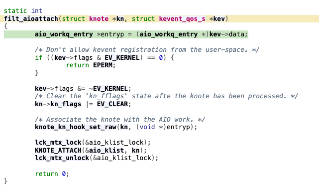
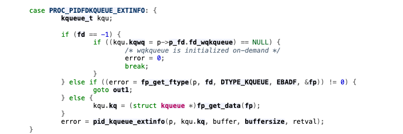
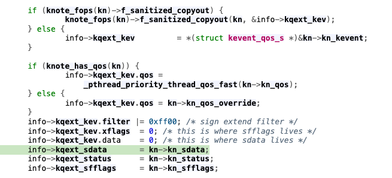
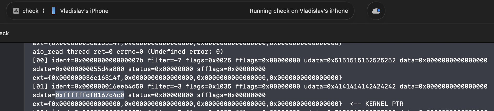

# Kernel address disclosure through AIO kqueue metadata

**TL;DR:** AIO uses `kevent.data` to carry the kernel address of an `aio_workq_entry`. Kqueue registration preserves that value in `kn_sdata`, but the AIO attach callback does not clear the saved copy after storing the pointer in `kn_hook`. The extended kqueue-information path later exposes `kn_sdata` as `kqext_sdata`, disclosing the object's kernel address while the AIO knote remains attached.

Fixed on iOS 27, assigned **CVE-2026-84530**.

---

## Root cause

The source walkthrough below follows `xnu-12377.101.15`. 

Let's start with [`aio_read`](https://github.com/apple-oss-distributions/xnu/blob/5c306bec31e314fa4d8bbdafb2f6f5a6b7e7b291/bsd/kern/kern_aio.c#L813), the asynchronous counterpart of `read`. Its kernel implementation is a thin wrapper around the common request-queueing routine, `aio_queue_async_request`.



Inside [`aio_queue_async_request`](https://github.com/apple-oss-distributions/xnu/blob/5c306bec31e314fa4d8bbdafb2f6f5a6b7e7b291/bsd/kern/kern_aio.c#L1988), `aio_create_queue_entry` allocates an `aio_workq_entry`. The address of this object, `entryp`, is the kernel heap pointer that will eventually be disclosed.

When the request's `sigev_notify` is `SIGEV_KEVENT`, completion notification is delivered through kqueue. The corresponding event is registered by `aio_register_kevent`.



[`aio_register_kevent`](https://github.com/apple-oss-distributions/xnu/blob/5c306bec31e314fa4d8bbdafb2f6f5a6b7e7b291/bsd/kern/kern_aio.c#L1556) constructs a synthetic kevent with `filter = EVFILT_AIO`. The important assignment is `kev.data = (intptr_t)entryp`: the event's data field is being used to pass an internal kernel pointer to the filter's attach callback. The function then calls `kevent_register`.



Because the event has `EV_ADD` set, [`kevent_register`](https://github.com/apple-oss-distributions/xnu/blob/f6217f891ac0bb64f3d375211650a4c1ff8ca1ea/bsd/kern/kern_event.c#L4120) takes the new-knote creation path. Before invoking the filter's attach callback, it copies the event into `kn->kn_kevent`.


The comment on `kevent_internal_s` explains an important detail of this copy: `kevent_qos_s::data` is saved in `kei_sdata`, also accessible through the `kn_sdata` alias. At this point, the `entryp` pointer is therefore already present in the knote's saved-data field.



The new knote is registered through `kq_add_knote`, after which the registration path invokes `fops->f_attach`. For `EVFILT_AIO`, that callback is `filt_aioattach`.



`filt_aioattach` retrieves `entryp` from `kev->data` and passes it to `knote_kn_hook_set_raw`, associating the knote with its AIO work item through `kn_hook`.



The association itself is not the problem. The mistake is leaving the earlier copy untouched: storing the pointer in `kn_hook` does not remove it from `kn_sdata`. The same internal pointer now exists in both places, and the saved-data copy remains available while the AIO knote is attached, before `filt_aiodetach` runs.

## User-space disclosure

The other half of the bug is in the extended kqueue-information interface. A [`proc_pidfdinfo`](https://github.com/apple-oss-distributions/xnu/blob/5c306bec31e314fa4d8bbdafb2f6f5a6b7e7b291/bsd/kern/proc_info.c#L2844) query with the `PROC_PIDFDKQUEUE_EXTINFO` flavor reaches `pid_kqueue_extinfo`.



[`pid_kqueue_extinfo`](https://github.com/apple-oss-distributions/xnu/blob/5c306bec31e314fa4d8bbdafb2f6f5a6b7e7b291/bsd/kern/kern_event.c#L9478) walks the process's knotes and calls `kevent_extinfo_emit` to populate the extended-information records returned to user space.


This is where the incomplete sanitization becomes visible. [`kevent_extinfo_emit`](https://github.com/apple-oss-distributions/xnu/blob/5c306bec31e314fa4d8bbdafb2f6f5a6b7e7b291/bsd/kern/kern_event.c#L9293) explicitly clears the ordinary event-data field, but copies the saved-data field into a separate member of the output structure:

```cpp
info->kqext_kev.data = 0;
info->kqext_sdata    = kn->kn_sdata;
```



Clearing `kqext_kev.data` is not enough. For an attached AIO knote, `kn_sdata` still contains `entryp`, so the separate `kqext_sdata` member exposes the address of the `aio_workq_entry` object.

The iOS PoC output shows precisely this distinction: the AIO record's ordinary `data` field is zero, while `sdata` contains the kernel pointer.



